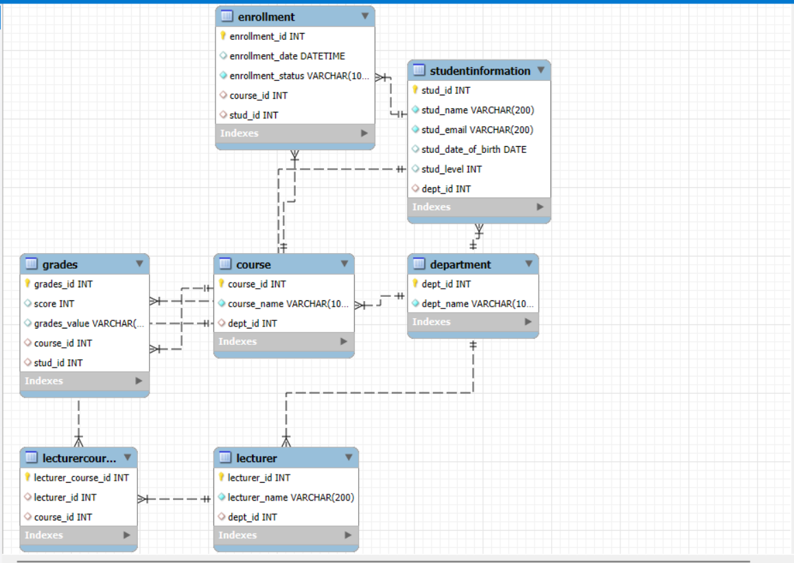

#  Student Records Database

## Description

This project is an sql database designed to manage and track student academic information in universities. It also enforces constraints and relationships through foreign keys and satisfies 1NF, 2NF and 3NF.

### Features:
- Tracks students, departments, and levels
- Map courses to departments
- Assign lecturers to courses
- Handle student course enrollments
- Store grades and scores per course


## Setup

###  Prerequisites
- MySQL Server installed
- MySQL Workbench or any SQL database client

### Cloning the Repository

```bash
git clone  https://github.com/Christabel-Akpene/Database-WK-8.git
cd Database-WK-8
```


### Running the Project

1. **Open MYSQL Workbench**
2. **Run the SQL script to create the database and tables** 
3. **Insert testing data**


## ERD Diagram



###  NB
- You can insert dummy data to test the database
- You can add new features when necessary by forking the repository.


